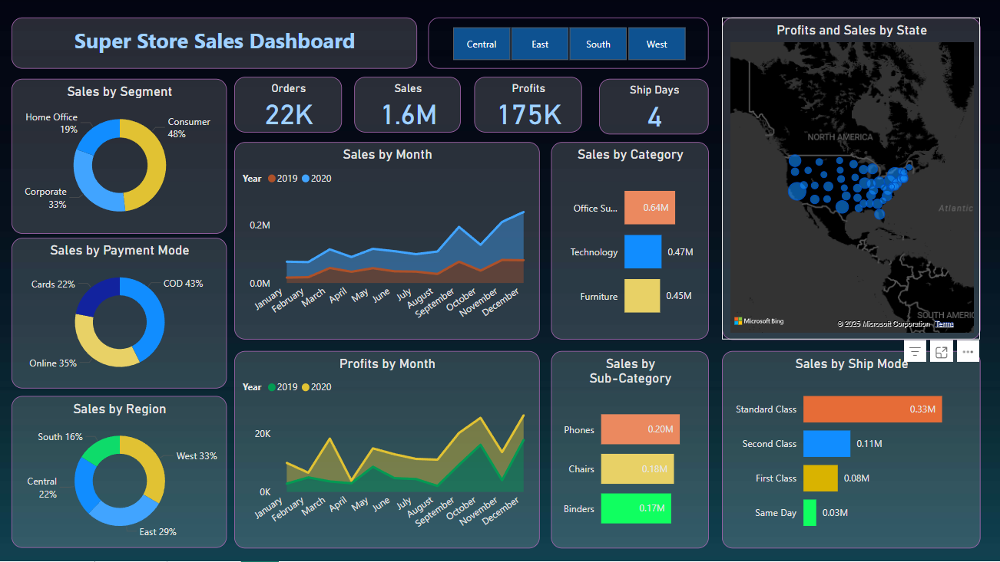
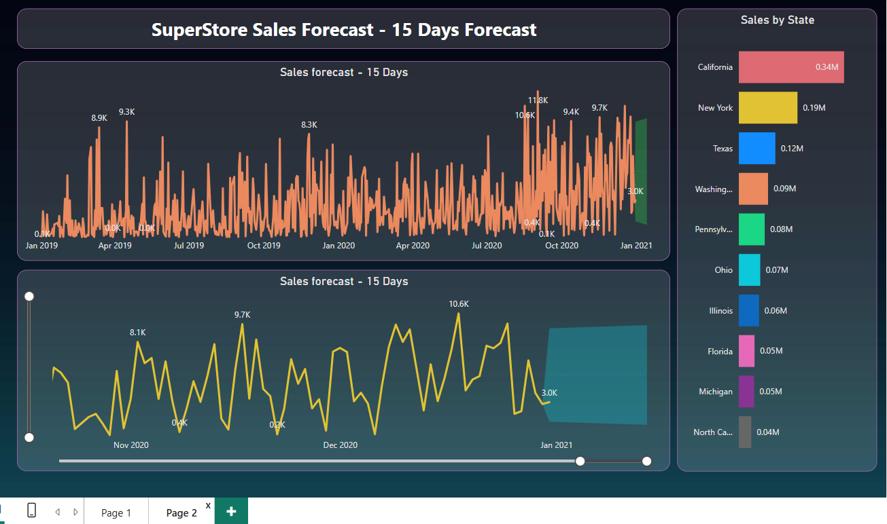

# 🛍️ Superstore Sales Dashboard (Power BI)

An interactive Power BI dashboard built using the Sample Superstore dataset to explore key business metrics like Sales, Profit, Orders, and Forecasting across multiple dimensions.

## 📊 Features

- Sales & Profit breakdown by Segment, Region, Category, Sub-Category, and Payment Mode
- Monthly trends and year-wise comparisons (2019 vs 2020)
- Interactive map showing Profits and Sales by U.S. state
- Sales by Shipping Mode
- 15-day Sales Forecast using time series data
- Page navigation for multi-page dashboard insights

## 📁 Dataset

- **Source**: [Sample Superstore Dataset](SuperStore_Sales_Dataset.csv)
- **Format**: CSV
- Includes transactional sales data such as order date, segment, category, shipping mode, location, and payment type.

## 🛠️ Built With

- **Power BI Desktop**
- **DAX** (Data Analysis Expressions)
- **Power Query**
- **Time Intelligence** for forecasting

## 🚀 Getting Started

To view and interact with the dashboard:

1. Download the Power BI `.pbix` file from this repository.
2. Open it with [Power BI Desktop](https://powerbi.microsoft.com/desktop/).
3. Explore dynamic visualizations and filters across different pages.

## 📷 Dashboard Previews

### 📈 Sales Overview

### 🔮 Sales Forecasting

## 🎥 Demo Video

(https://drive.google.com/file/d/1gFk_XAiQQyotC5F97UgR6AuGeqrgKcXJ/view?usp=sharing)

## 📌 Key Insights

- **Highest Sales**: West region and Consumer segment
- **Top Categories**: Office Supplies and Technology
- **Most Used Payment Mode**: Cash on Delivery (43%)
- **State with Highest Sales**: California
- **Sales Forecast**: Next 15 days projected using historical patterns

## 📄 License

This project is licensed under the [MIT License](LICENSE).

---

**📬 Feel free to fork, clone, or contribute to enhance functionality or explore new KPIs!**
